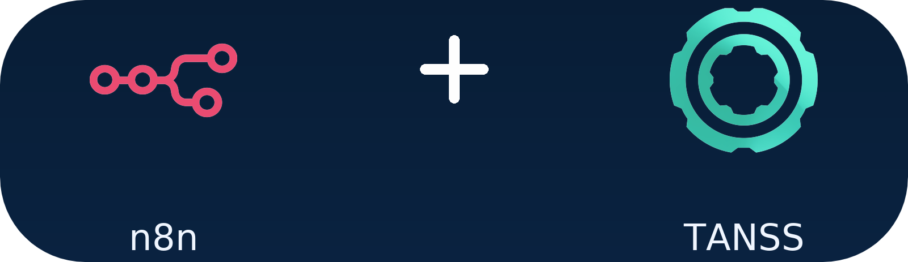

# Important for the old Tanss Node Users

A new **TANSS Node** was released on **October 27, 2025** [here](https://github.com/BuddiesD/n8n-nodes-tanss).  
Please note that **existing credentials are not compatible** due to the introduction of **2FA (Two-Factor Authentication)**.

You can install both versions, but **2FA functionality will only be visible after uninstalling** the old package.

Old: [n8n-nodes-tanss-api](https://www.npmjs.com/package/n8n-nodes-tanss-api)<br>
New: [n8n-nodes-tanss](https://www.npmjs.com/package/n8n-nodes-tanss)


# n8n-nodes-tanss

<div align="center">

</div>
<br>
This is an n8n community node. It lets you use the TANSS API in your n8n workflows.<br>
TANSS is a professional ticket and service management system for handling support tickets, customer communication, and internal processes.

[n8n](https://n8n.io/) is a [fair-code licensed](https://docs.n8n.io/sustainable-use-license/) workflow automation platform.

## Contents

- [Installation](#installation)
- [Operations](#operations)
- [Credentials](#credentials)
- [Compatibility](#compatibility)
- [Resources](#resources)
- [ToDo](#to-do--progress)
- [Changelog](CHANGELOG.md)
- [Contributing](#contributing)

## Installation

### For installation in n8n

Follow the official [installation guide](https://docs.n8n.io/integrations/community-nodes/installation/) in the n8n community nodes documentation.

---

### For Local Development

This project is an **n8n community node** and must be run from source for local development.

#### Prerequisites

- Node.js (v22.20.0 recommended)
- npm

#### 1. Clone the repository

You can clone the repository anywhere on your system — it does **not** need to be inside the n8n directory.
```bash
git clone https://github.com/BuddiesD/n8n-nodes-tanss.git
cd n8n-nodes-tanss
```
#### 2. Install dependencies
```bash
npm install
```
#### 3. Start development mode

Run the node in development mode with live reloading:

```bash
npm run dev
```
This command uses `n8n-node dev` to build the node, start a local n8n instance, and automatically apply code changes during development.

`npm run dev` is equivalent to running `n8n-node dev` directly.

### Development (Dev Container)
To start **n8n** with the custom node, run: `npm run dev`

Note: The first startup may time out because n8n is being downloaded and set up.

## Operations

The following operations are supported by this node and are documented in the **ToDo list** and the **TANSS API documentation**.

**Operations currently implemented** in the node are marked as **Done** or **Testing** in the **ToDo list**.
A complete overview of all available operations can be found in the TANSS API documentation.

- [ToDo](#to-do--progress)
- [Tanss API documentation](https://api-doc.tanss.de/)

## Credentials

You only need to provide:

- `backend url (api url)`
- `username`
- `password`
- optionally: `TOTP Secret Key` (for two-factor authentication)

## Compatibility

Compatible with n8n@1.60.0 or later<br>
Tested with TANSS API. Version: 10.12.0

## Resources

* [n8n community nodes documentation](https://docs.n8n.io/integrations/#community-nodes)
* [Tanss API documentation](https://api-doc.tanss.de/)

## To-Do / Progress

**Status / Progress**  
Progress: **143 / 271 (1 not in API Docs)** (53%)

<details>
<summary><strong>Complete overview</strong></summary>

<br>
<details>
<summary><strong>security [1/1] - Done</strong></summary>

  - [x] Login with Username & Password
  - [x] 2FA Auth Support  
</details>
<details>
<summary><strong>tickets [6/6] - Done</strong></summary>

  - [x] [POST] Creates a ticket in the database
  - [x] [GET] Gets a ticket by id
  - [x] [DEL] Deletes a ticket by id
  - [x] [PUT] Updates a ticket
  - [x] [GET] Gets a ticket history
  - [x] [POST] Creates a comment
  - [x] [PUT] Merge two Tickets (not in API Docs)
</details>
<details>
<summary><strong>ticket lists [10/10] - Done</strong></summary>

  - [x] [GET] gets a list of own tickets (assigned to currently logged in employee)
  - [x] [GET] gets a list of general tickets (assigned to no employee)
  - [x] [GET] gets a list of company tickets
  - [x] [GET] gets a list of tickets of all technicians
  - [x] [GET] gets a list of repair tickets
  - [x] [GET] gets a list of not identified tickets
  - [x] [GET] gets a list of all projects
  - [x] [GET] gets a list of all tickets which are assigned to local ticket admins
  - [x] [GET] gets a list of all ticket which a technician has a role in
  - [x] [PUT] Get a (custom) ticket list
</details>
<details>
<summary><strong>ticket content [5/5] - Done</strong></summary>

  - [x] [GET] Gets all ticket documents
  - [x] [GET] Gets a ticket document
  - [x] [GET] Gets all ticket images
  - [x] [GET] Gets a ticket image
  - [x] [POST] upload a document/image
</details>
<details>
<summary><strong>ticket states [4/4] - Done</strong></summary>

  - [x] [GET] Gets a list of all ticket states
  - [x] [POST] Creates a ticket state
  - [x] [PUT] Updates a ticket state
  - [x] [DEL] Deletes a ticket state
</details>
<details>
<summary><strong>timestamp [15/15] - Done</strong></summary>

  - [x] [GET] gets a list of timestamps from a given period
  - [x] [POST] writes a timestamp into the database
  - [x] [PUT] edits a single timestamp
  - [x] [PUT] writes the timstamps of a whole day into the database at once
  - [x] [GET] gets the timestamp infos for a given time period
  - [x] [GET] gets the timestamp infos for a given time period (with statistical values)
  - [x] [POST] does one or more "day closings" for the timestamp module
  - [x] [DEL] remove / undo one or more "day closings" for the timestamp module
  - [x] [GET] gets all infos about last dayclosings for employees
  - [x] [POST] created dayClosings to a given date
  - [x] [POST] sets the initial balance for this employee
  - [x] [GET] gets a list of all pause configs
  - [x] [POST] creates a pause config
  - [x] [PUT] updates a pause config
  - [x] [DEL] deletes a pause config
</details>
<details>
<summary><strong>calls [9/9] - Done</strong></summary>

  - [x] [POST] Creates/imports a phone call into the database
  - [x] [PUT] Get a list of phone calls
  - [x] [GET] Get phone call by id
  - [x] [PUT] Update phone call
  - [x] [POST] identifies a phone call
  - [x] [GET] Get all employee assignments
  - [x] [POST] Creates a new employee assignment
  - [x] [DEL] Deletes an employee assignment
  - [x] [POST] Creates a call notification
</details>
<details>
<summary><strong>calls (user context) [3/3] - Done</strong></summary>

  - [x] [PUT] Get a list of phone calls
  - [x] [GET] Get phone call by id
  - [x] [POST] identifies a phone call
</details>
<details>
<summary><strong>remote supports [11/11] - Done</strong></summary>

  - [x] [POST] Creates/imports a remote support into the database
  - [x] [PUT] Get list of remote supports
  - [x] [GET] Get remote support by id
  - [x] [PUT] Updates a remote support
  - [x] [DEL] Delete remote support
  - [x] [GET] Gets all device assignments
  - [x] [POST] Creates a device assignment
  - [x] [DEL] Deletes a device assignment
  - [x] [GET] Gets all technician assignments
  - [x] [POST] Creates a technician assignment
  - [x] [DEL] Delets a technician assignment
</details>
<details>
<summary><strong>monitoring [0/7] - ToDo</strong></summary>

  - [ ] [POST] Creates a ticket, using the monitoring api
  - [ ] [POST] Assigns a groupName to a company or device
  - [ ] [DEL] Delete a group assignment
  - [ ] [GET] Gets all group assignments
  - [ ] [GET] Gets ticket(s), based on a given group
  - [ ] [GET] Gets a ticket (created by the monitoring api) by id
  - [ ] [PUT] Updates a ticket (created by the monitoring api) by id
</details>
<details>
<summary><strong>erp [0/16] - ?</strong></summary>

  - [ ] [POST] Insert new invoices
  - [ ] [GET] Gets a list of billable supports
  - [ ] [GET] Get a list of customers and employees
  - [ ] [POST] Insert new customers
  - [ ] [POST] create a new ticket
  - [ ] [GET] gets a list of tickets states
  - [ ] [GET] gets a list of tickets types
  - [ ] [POST] upload a document/image into a ticket
  - [ ] [GET] get all employees from the own company
  - [ ] [GET] gets all departments
  - [ ] [GET] list of company categories
  - [ ] [POST] Creates a new company category
  - [ ] [GET] gets all employees of a department
  - [ ] [GET] search for a company
  - [ ] [GET] gets all departments of a employee
  - [ ] [GET] gets all users with the associated departments
</details>
<details>
<summary><strong>chats [0/10] - ToDo</strong></summary>

  - [ ] [POST] Creates a new chat
  - [ ] [PUT] Get a list of chats
  - [ ] [GET] Gets a chat
  - [ ] [GET] Gets chat close requests
  - [ ] [POST] Creates a new chat message
  - [ ] [POST] Adds a participant
  - [ ] [DEL] Deletes a participant
  - [ ] [POST] Closes a chat
  - [ ] [PUT] Accept/decline close request
  - [ ] [POST] re-opens a chat
</details>
<details>
<summary><strong>offer [0/16] - ?</strong></summary>

  - [ ] [POST] Creates a new erp selection
  - [ ] [GET] Fetches an erp selection
  - [ ] [PUT] Updates an erp selection
  - [ ] [DEL] Deletes an erp selection
  - [ ] [GET] Gets list of offer templates
  - [ ] [POST] Creates an offer template
  - [ ] [GET] Gets an offer templates
  - [ ] [PUT] Updates an offer templates
  - [ ] [DEL] Deletes an offer template
  - [ ] [GET] material picker
  - [ ] [GET] material picker for erp selection
  - [ ] [PUT] Gets list of offers
  - [ ] [POST] Creates an offer
  - [ ] [GET] Gets an offer
  - [ ] [PUT] Updates an offer
  - [ ] [DEL] Deletes an offer
</details>
<details>
<summary><strong>availability [1/1] - Done</strong></summary>

  - [x] [GET] Fetches availability infos
</details>
<details>
<summary><strong>employees [2/2] - Done</strong></summary>

  - [x] [GET] Gets all technicians
  - [x] [POST] creates an employee
</details>
<details>
<summary><strong>mails [1/1] - Done</strong></summary>

  - [x] [POST] Test email smtp settings
</details>
<details>
<summary><strong>tags [0/10] - ToDo</strong></summary>

  - [ ] [POST] Creates a new tag
  - [ ] [GET] Get all tags
  - [ ] [GET] Gets a tag
  - [ ] [PUT] Edits a tag
  - [ ] [DEL] Deletes a tag
  - [ ] [POST] Assigns a tag
  - [ ] [DEL] Removes a tag
  - [ ] [GET] List of tags to an assignment
  - [ ] [PUT] Assigns multiple tags
  - [ ] [GET] List of tags logs to an assignment
</details>
<details>
<summary><strong>callback [4/4] - Done</strong></summary>

  - [x] [POST] Creates a callback
  - [x] [PUT] Get a list of callbacks
  - [x] [GET] Gets a callback
  - [x] [PUT] Updates a callback
</details>
<details>
<summary><strong>search [1/1] - Done</strong></summary>

  - [x] [PUT] global search
</details>
<details>
<summary><strong>checklists [5/5] - Done</strong></summary>

  - [x] [POST] Assigns a checklist to a ticket
  - [x] [DEL] Removes a checklist from a ticket
  - [x] [GET] Gets checklists for a ticket
  - [x] [GET] Gets checklist for ticket
  - [x] [PUT] Check an item
</details>
<details>
<summary><strong>supports [0/5] - ToDo</strong></summary>

  - [ ] [PUT] Get a support list
  - [ ] [POST] Creates a support/appointment
  - [ ] [GET] Gets a support/appointment
  - [ ] [PUT] Edits a support/appointment
  - [ ] [POST] Uploads a signature for supports
</details>
<details>
<summary><strong>timers [0/8] - ?</strong></summary>

  - [ ] [GET] Get all timers of current user
  - [ ] [POST] Creates a timer
  - [ ] [DEL] Deletes a timer
  - [ ] [GET] Get a specific timer
  - [ ] [PUT] Starts/stops timer
  - [ ] [GET] Get all timer fragments
  - [ ] [DEL] Deletes a timer fragment
  - [ ] [PUT] Updates a timer fragment
</details>
<details>
<summary><strong>pc [5/5] - Done</strong></summary>

  - [x] [GET] Gets a pc by id
  - [x] [PUT] Updates a pc
  - [x] [DEL] Deletes a pc
  - [x] [POST] Creates a pc
  - [x] [PUT] Gets a list of pcs
</details>
<details>
<summary><strong>periphery [11/11] - Testing</strong></summary>

  - [x] [GET] Gets a periphery by id
  - [x] [PUT] Updates a periphery
  - [x] [DEL] Deletes a periphery
  - [x] [POST] Creates a periphery
  - [x] [PUT] Gets a list of peripheries
  - [x] [GET] Get periphery types
  - [x] [POST] Create periphery type
  - [x] [PUT] Update periphery type
  - [x] [DEL] Delete periphery type
  - [x] [POST] Assign periphery
  - [x] [DEL] Delete periphery assignment
</details>
<details>
<summary><strong>components [9/9] - Testing</strong></summary>

  - [x] [GET] Gets a component by id
  - [x] [PUT] Updates a component
  - [x] [DEL] Deletes a component
  - [x] [POST] Creates a component
  - [x] [PUT] Gets a list of components
  - [x] [GET] Gets a list of component types
  - [x] [POST] Create component type
  - [x] [PUT] Update component type
  - [x] [DEL] Delete component type
</details>
<details>
<summary><strong>services [0/5] - ?</strong></summary>

  - [ ] [POST] Creates a service
  - [ ] [GET] Gets a list of all services
  - [ ] [GET] Gets a service by id
  - [ ] [PUT] Updates a service
  - [ ] [DEL] Deletes a service
</details>
<details>
<summary><strong>ips [4/4] - Done</strong></summary>

  - [x] [GET] Gets ip addresses
  - [x] [POST] Creates an ip address
  - [x] [PUT] Update ip address
  - [x] [DEL] Deletes an ip address
</details>
<details>
<summary><strong>company [0/2] - ToDo</strong></summary>

  - [ ] [POST] Creates a new company
  - [ ] [GET] Gets all employees of a company
</details>
<details>
<summary><strong>company category [10/10] - Done</strong></summary>

  - [x] [GET] list of categories
  - [x] [POST] Creates a new company category
  - [x] [GET] gets a category
  - [x] [PUT] updates a category
  - [x] [DEL] Deletes a company category
  - [x] [GET] list of company types
  - [x] [POST] Creates a new company type -- This option is experiencing a error right now. A fix will be included in the next Tanss update.
  - [x] [GET] gets a company type
  - [x] [PUT] updates a company type
  - [x] [DEL] Deletes a company type
</details>
<details>
<summary><strong>documents [0/6] - ?</strong></summary>

  - [ ] [PUT] Get a list of company documents
  - [ ] [POST] Creates a document
  - [ ] [GET] Get a single document (including content)
  - [ ] [PUT] Updates a document
  - [ ] [DEL] Deletes a document
  - [ ] [POST] Uploads a file
</details>
<details>
<summary><strong>webHooks [0/6] - ?</strong></summary>

  - [ ] [POST] creates a rule
  - [ ] [PUT] get a list of rules
  - [ ] [PUT] updates a rule
  - [ ] [GET] gets a rule
  - [ ] [DEL] deletes a rule
  - [ ] [PUT] test a rule
</details>
<details>
<summary><strong>ticket board [0/10] - ?</strong></summary>

  - [ ] [GET] Gets the ticket board with all panels
  - [ ] [GET] Gets an empty ticket board panel
  - [ ] [POST] Creates a new ticket board panel
  - [ ] [PUT] Updates a ticket board panel
  - [ ] [GET] Gets a ticket board panel
  - [ ] [DEL] Deletes a ticket board panel
  - [ ] [GET] Gets all registers from a ticket board panel
  - [ ] [GET] Gets a ticket board from a project
  - [ ] [GET] Gets all registers from a ticket board project
  - [ ] [GET] Get global ticket panels
</details>
<details>
<summary><strong>operating systems [5/5] - Done</strong></summary>

  - [x] [POST] Creates a new os
  - [x] [GET] Get a list of all os
  - [x] [PUT] Updates a os
  - [x] [GET] Get a specific os
  - [x] [DEL] Deletes a specific os
</details>
<details>
<summary><strong>manufacturer [5/5] - Done</strong></summary>

  - [x] [POST] Creates a new manufacturer
  - [x] [GET] Get a list of all manufacturers
  - [x] [PUT] Updates a manufacturer
  - [x] [GET] Get a manufacturer
  - [x] [DEL] Deletes a manufacturer
</details>
<details>
<summary><strong>cpus [5/5] - Done</strong></summary>

  - [x] [POST] Creates a new cpu
  - [x] [GET] Get a list of all cpus
  - [x] [PUT] Updates a cpu
  - [x] [GET] Get a cpu
  - [x] [DEL] Deletes a cpu
</details>
<details>
<summary><strong>hddTypes [5/5] - Done</strong></summary>

  - [x] [POST] Creates a new hdd type
  - [x] [GET] Get a list of all hdd types
  - [x] [PUT] Updates a hdd type
  - [x] [GET] Get a hdd type
  - [x] [DEL] Deletes a hdd type
</details>
<details>
<summary><strong>identify [0/1] - ToDo</strong></summary>

  - [ ] [POST] identifies items
</details>
<details>
<summary><strong>emailAccounts [0/6] - ?</strong></summary>

  - [ ] [POST] Creates an email account
  - [ ] [GET] List accounts of company
  - [ ] [GET] Gets an account
  - [ ] [PUT] Edit an accounts
  - [ ] [DEL] Deletes an account
  - [ ] [GET] List account types
</details>
<details>
<summary><strong>vacationRequests [0/7] - ToDo</strong></summary>

  - [ ] [PUT] Gets a list of vacation requests
  - [ ] [GET] Gets a list of absence/custom types
  - [ ] [POST] creates a vacation request
  - [ ] [PUT] updates a vacation request
  - [ ] [DEL] deletes a vacation request
  - [ ] [GET] gets the available vacation days per year
  - [ ] [POST] sets the available vacation days per year
</details>
<details>
<summary><strong>activityFeed [0/3] - ?</strong></summary>

  - [ ] [PUT] List of user items
  - [ ] [GET] Number of unseen events
  - [ ] [POST] Marks all as seen
</details>
<details>
<summary><strong>domains [5/5] - Done</strong></summary>

  - [x] [POST] Creates a domain -- This option is experiencing a error right now, Waiting for Support
  - [x] [GET] Gets a single domain
  - [x] [PUT] Updates a domain
  - [x] [DEL] Deletes a domain
  - [x] [GET] List of domains of a company
</details>
<details>
<summary><strong>software licenses [0/10] - ?</strong></summary>

  - [ ] [PUT] Get a list of software licenses
  - [ ] [POST] Creates a software license
  - [ ] [GET] Gets a single software license by id
  - [ ] [PUT] Updates a software license
  - [ ] [DEL] Deletes a software license
  - [ ] [GET] Gets all software license types
  - [ ] [POST] Creates a new software license type
  - [ ] [GET] Gets a single software license type
  - [ ] [PUT] Updates a software license type
  - [ ] [DEL] Deletes a software license type
</details>

</details>

## Contributing

Thank you for considering contributing to this project! Community contributions are what keep open-source projects growing and improving, and every contribution is highly appreciated.

When submitting bug reports, please make sure they are:

- **Reproducible** – clearly describe the steps required to reproduce the issue.
- **Detailed** – include relevant information such as versions, environment, and setup.
- **Unique** – avoid creating duplicate issues by checking existing ones first.
- **Focused** – report one bug per issue to keep discussions clear and effective.

